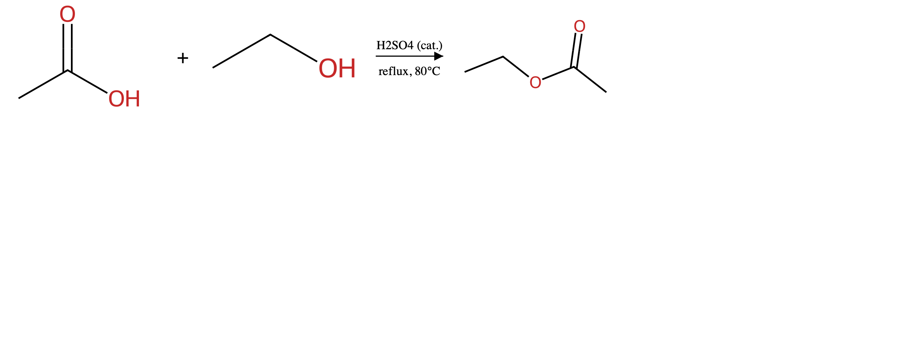

# imageGen

**Scientific figure generation — vector-first, IR-driven.** imageGen turns a
structured description of a biological pathway, chemical reaction, cellular
schematic, or experimental workflow into a publication-style figure (SVG, PNG,
or PDF) using curated, convention-following primitives.

It is built to be driven by an LLM (`SKILL.md` is the model-facing interface),
but the rendering pipeline is an ordinary Python library you can call directly.



---

## How it works

imageGen never goes prompt → pixels. Every figure passes through a typed
**Intermediate Representation (IR)** and a deterministic pipeline:

```
IR (validated Figure) → layout engine → compositor → SVG → PNG/PDF
                                                  ↓
                                        verification suite
```

- **IR** — a Pydantic-validated `Figure`: entities, compartments, relations,
  reaction conditions, and optional panels. Defined in `imageGen/ir/schema.py`.
- **Layout engines** — place IR elements deterministically (`imageGen/layout/`).
- **Compositor** — assembles primitives into an SVG and exports raster formats
  (`imageGen/render/`).
- **Verification** — three fail-loud audits over the rendered SVG: every IR
  element is present (`semantic`), text is legible (`legibility`), and
  scientific conventions hold — T-bars for inhibition, correct entity shapes
  (`convention`).

## Archetypes

| Archetype | What it draws |
|-----------|---------------|
| `PATHWAY` | Signaling / regulatory pathways — entities connected by activation, inhibition, binding, translocation arrows. |
| `REACTION_SCHEME` | Chemical reactions — RDKit-rendered molecules with a reaction arrow and conditions. |
| `WORKFLOW` | Multi-step experimental workflows, optionally as multi-panel figures. |
| `CELLULAR_SCHEMATIC` | Subcellular layouts — entities placed into compartment bands. |
| `MECHANISM_CARTOON` | Reaction-mechanism cartoons — intermediates linked by arrows. |

See [`references/examples/`](references/examples/) for one rendered figure per
archetype, ordered by complexity.

## Install

imageGen uses the shared Desktop venv (`~/Desktop/.venv`, Python 3.12) — don't
create a project-local one. Install the package in editable mode:

```bash
~/Desktop/.venv/bin/pip install -e .
```

Runtime dependencies (already in the shared venv): `pydantic`, `svgwrite`,
`cairosvg`, `networkx`, `rdkit`. The test suite additionally uses `pytest`,
`numpy`, and `Pillow`.

## Usage

### Command line

```bash
python -m imageGen tests/fixtures/simple_activation.json -o figure.png
python -m imageGen tests/fixtures/mapk_cascade.json -o figure.pdf --style nature
python -m imageGen tests/fixtures/simple_reaction.json -o rxn.png \
    --smiles-map smiles.json
```

Flags: `--style {cell_press,nature,acs}`, `--format {svg,png,pdf}` (inferred
from the output suffix when omitted), `--dpi N` (default 300),
`--smiles-map FILE.json` (required for `REACTION_SCHEME`), `--no-labels`.

### Python API

```python
import json
from imageGen.ir.schema import Figure
from imageGen.render.compositor import render_figure

ir = Figure.model_validate(json.loads(open("figure.json").read()))
render_figure(ir, "out.png", style_name="cell_press", dpi=300)
```

A non-SVG render also writes a sibling `.svg` next to the output for debugging.

## Project layout

```
imageGen/
  ir/          IR schema (Pydantic models + validators)
  primitives/  curated visual building blocks (proteins, membranes, arrows…)
  layout/      per-archetype layout engines + label placement
  styles/      journal-style presets (cell_press, nature, acs)
  render/      compositor, exporters, CLI
  verify/      semantic / legibility / convention checks
references/    conventions notes + worked examples
tests/         pytest suite + golden-image regressions
SKILL.md       the model-facing interface (LLM frontend)
```

## Tests

```bash
~/Desktop/.venv/bin/pytest tests/ -v
```

**373 tests** pass. Golden-image regressions render curated fixtures and
pixel-diff them against checked-in baselines; after an intentional visual
change regenerate with `IMAGEGEN_REGEN_GOLDEN=1 pytest`.

## Documentation

- **[SKILL.md](SKILL.md)** — the model-facing interface (when to trigger, the
  classify → IR → render → verify workflow, IR reference, cookbook).
- **[LIMITATIONS.md](LIMITATIONS.md)** — known v1 limitations.
- **[FEEDBACK.md](FEEDBACK.md)** — log a wrong or low-quality figure here.
- **[CONTRIBUTING.md](CONTRIBUTING.md)** — for developers and AI agents
  extending the project: workflow, conventions, hard rules.
- **[ROADMAP.md](ROADMAP.md)** — phase status (all 8 phases complete at v1.0).
- **[DECISIONS.md](DECISIONS.md)** — cross-phase architectural decisions.
